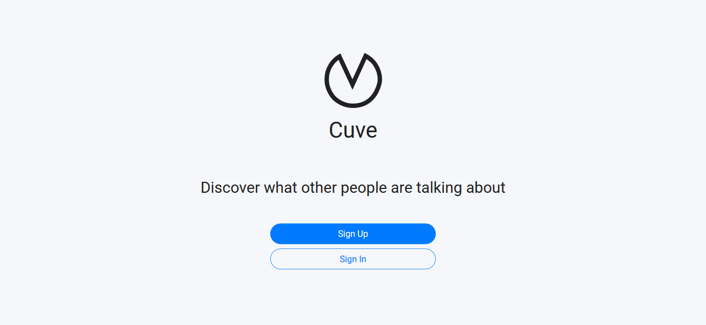
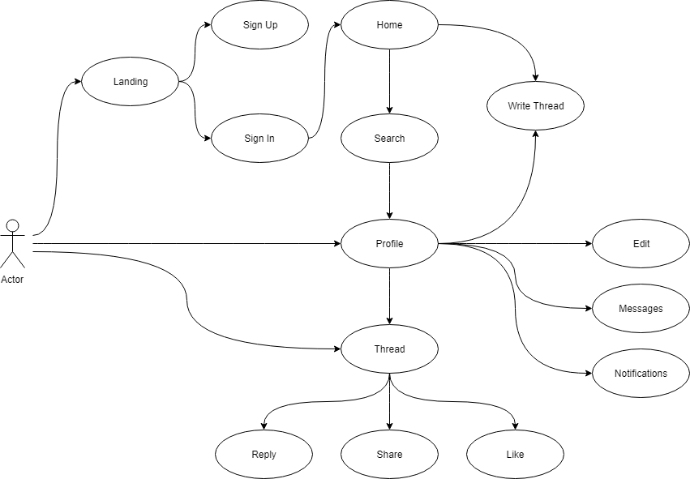
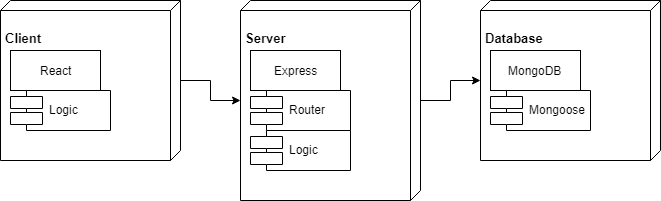
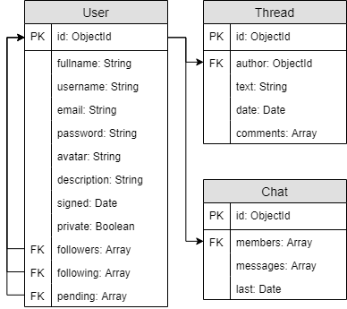

# Cuve

## Description

The project is a social network based on Twitter.

Users can post their thoughts, reply, share and like it. They can also follow other users and see what they say and share, who they follow and who follows them. The users who are following each other can chat between them. Users also have the possibility to have a private profile and only those users who accept can follow them.

## Technologies

### Back-End

- Node.js
- Express
- JWT
- MongoDB
- Mongoose
- Mocha
- Chai

### Front-End

- React
- Bootstrap

## Screenshots

## Diagrams

### Use Case

### Components

### Class Diagram

### Data Model
